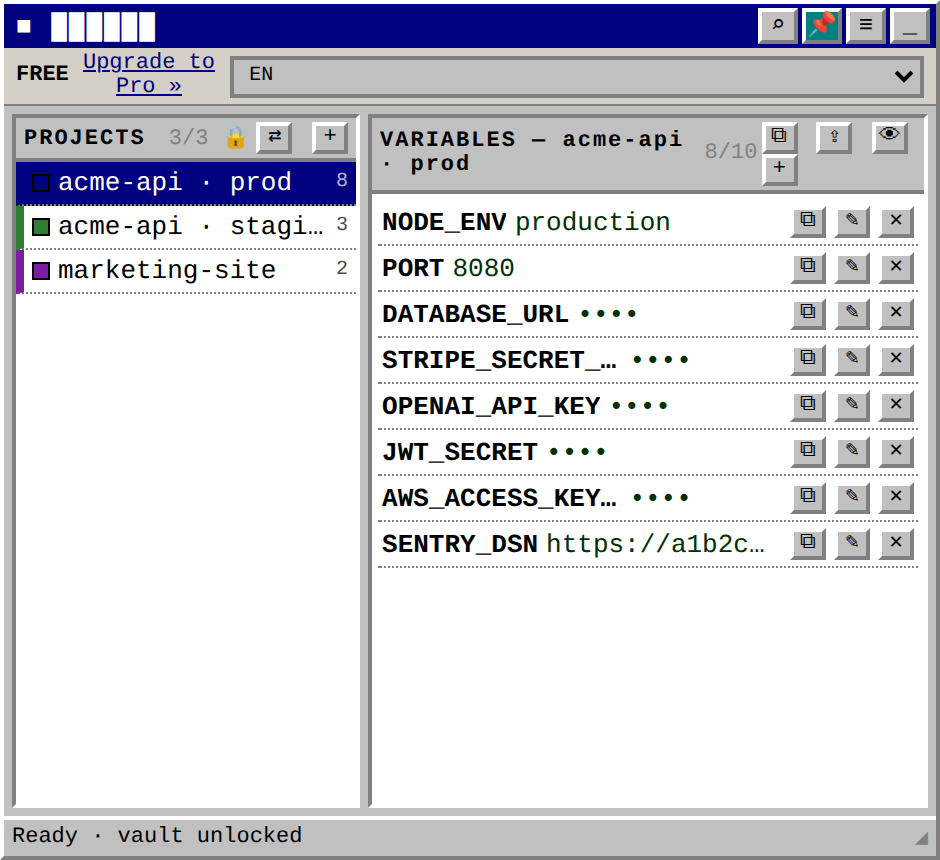
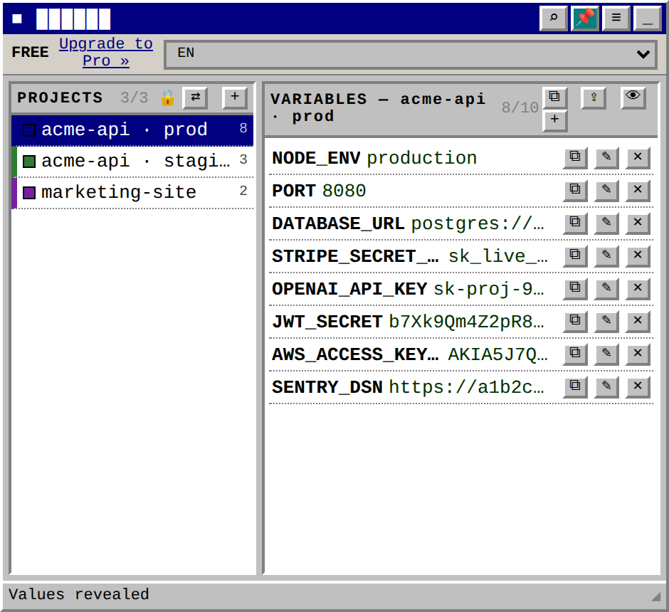
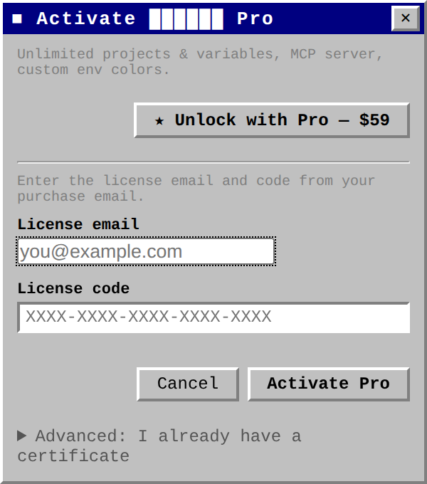
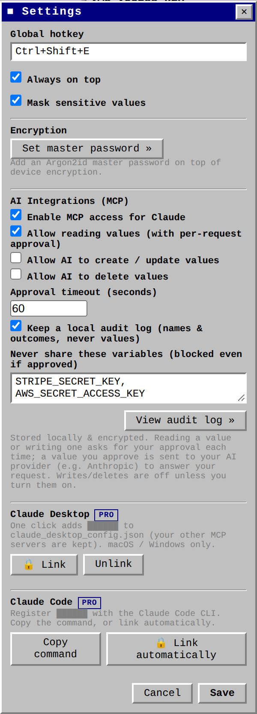
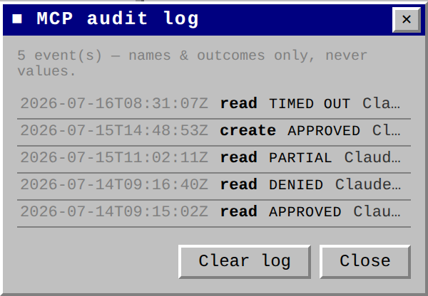
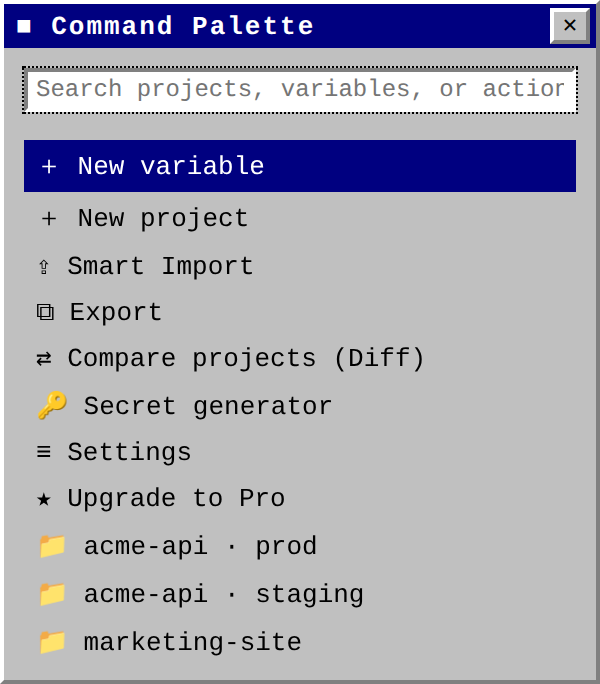
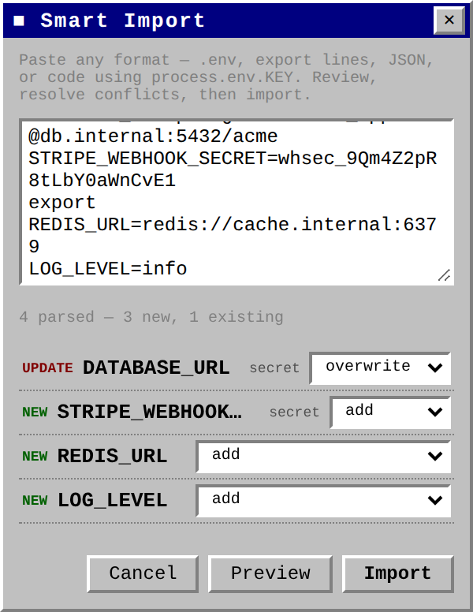
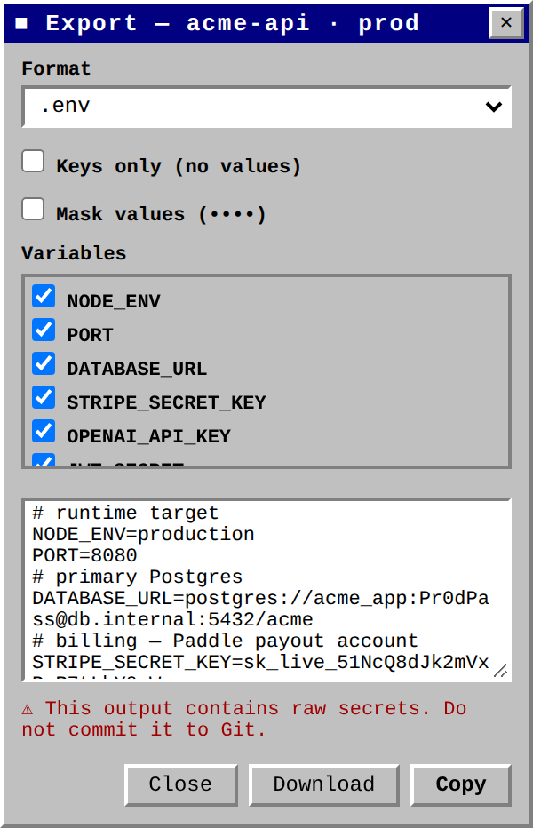

# 포트폴리오 — 로컬 우선 시크릿 매니저 + AI(MCP) 연동 데스크톱 앱

> 제품명은 비공개(NDA) 처리되어 있습니다. 문서·스크린샷 전반에서 실제 제품명은 **██████** 로 마스킹했습니다.

**한 줄 소개** — 개발자의 `.env` 시크릿을 기기에 **AES-256-GCM으로 암호화 저장**하고, Claude(Desktop/Code)에 **MCP로 노출하되 값이 나갈 때마다 사용자가 직접 승인**하게 만든 로컬 우선(local-first) 데스크톱 앱. **Paddle 기반 결제 → 서명 라이선스 발급 → 오프라인 검증**까지 엔드투엔드로 구현했습니다.

| 항목 | 내용 |
| --- | --- |
| **유형** | 크로스플랫폼 데스크톱 앱(Tauri v2) + 독립 결제 백엔드(Rust) |
| **역할** | 제품 기획 · 아키텍처 · 프론트엔드 · Rust 코어 · 결제/라이선스 인프라 (전 영역) |
| **핵심 스택** | Rust · Tauri v2 · Vanilla JS · Paddle Billing · Supabase · Railway · Resend · MCP(JSON-RPC 2.0) |
| **보안** | AES-256-GCM · Argon2id · Ed25519 서명 라이선스 · fail-closed 승인 게이트 |
| **규모** | Rust ≈ 6,900 LOC · Frontend ≈ 2,100 LOC · 단위/통합 테스트 132개 · 다국어 7종 |
| **상태** | MVP 완성 (v0.1.3), 결제→활성화 플로우 엔드투엔드 동작 |

---

## 1. 문제 정의

개발자는 API 키·DB 비밀번호·토큰을 `.env` 파일로 관리하지만,

1. **AI 코딩 도구가 대중화**되면서 "내 시크릿을 AI에게 안전하게 넘기는 법"이라는 새로운 문제가 생겼고,
2. 기존 시크릿 매니저는 **클라우드 계정에 시크릿을 올려야** 하며,
3. AI에게 값을 넘기는 순간 **사용자 통제권이 사라진다**는 우려가 있었습니다.

**목표:** "시크릿은 내 기기에만 암호화되어 있고, AI가 값을 읽으려면 매번 내가 직접 허락한다"를 **기술적으로 강제**하는 도구.

---

## 2. 솔루션 & 핵심 화면 (실제 캡쳐)

> 아래 이미지는 실제 앱 UI를 그대로 캡쳐한 것입니다. 제품명이 들어가던 자리는 **██████** 로 가렸습니다.

### 2.1 메인 — 프로젝트별 시크릿 관리
80년대 Windows 스타일의 항상-위(always-on-top) 플로팅 창. 값은 기본적으로 마스킹(`••••`)되며, 공개 값(`NODE_ENV`, `PORT` 등)만 노출됩니다. 무료 티어의 사용량(`3/3`, `8/10`)이 그대로 보입니다.



값 마스킹은 👁 토글로 즉시 해제할 수 있습니다.



### 2.2 결제 & Pro 활성화 — **Paddle 기반 라이선스** ★
무료 티어(프로젝트 3개 / 프로젝트당 변수 10개) 상한에 도달하면 업그레이드 창이 뜹니다. **Paddle Billing으로 결제 → 이메일로 짧은 라이선스 코드 수신 → 앱에 코드+이메일 입력 → 오프라인 검증 후 Pro 해제**되는 구조입니다. 구독이 아닌 **1회 결제($59) 평생 라이선스**.



### 2.3 AI 통합(MCP) 설정 — 보안 정책
Claude에 노출할 권한을 사용자가 직접 통제합니다. 읽기는 매 요청 승인, **쓰기/삭제는 기본 OFF(옵트인)**, 승인 타임아웃, 로컬 감사 로그, 그리고 "승인해도 절대 공유하지 않을 변수" 목록까지 설정할 수 있습니다. Claude Desktop / Claude Code 연동은 Pro 게이팅.



### 2.4 감사 로그 — 값이 아닌 "행위"만 기록
AI가 어떤 변수에 접근을 시도했고 승인/거부/타임아웃되었는지 로컬에 기록합니다. **값은 절대 로그에 남기지 않습니다**(이름·결과만).



### 2.5 개발자 편의 도구
키보드 우선 커맨드 팔레트(`Ctrl+K`), 스마트 임포트(임의 형식 붙여넣기 → 충돌 해결 → 반영), 다양한 포맷 내보내기.

| 커맨드 팔레트 | 스마트 임포트 | 내보내기 |
| --- | --- | --- |
|  |  |  |

---

## 3. 아키텍처

```
██████/
├── crates/core/          ⭐ 순수 Rust, GUI 의존성 0 — 보안 로직 전부 여기 + 단위테스트
│   ├── crypto            AES-256-GCM 봉인 + Argon2id 마스터패스워드 볼트
│   ├── storage           암호화 파일(enc_state), 기기 바인딩 키, 마이그레이션
│   ├── license           Ed25519 서명 라이선스 오프라인 검증
│   ├── claude_config     Claude Desktop 설정 비파괴적 병합
│   └── mcp/server        JSON-RPC 2.0 MCP 서버 (STDIO)
├── src-tauri/            Tauri v2 데스크톱 셸 (GUI ↔ 코어, --mcp 런타임)
├── src/                  Vanilla JS 레트로 프론트엔드 (HTML/CSS/JS)
├── payments/webhook/     독립 배포되는 Rust 결제 웹훅 (Paddle → 라이선스 발급)
└── landing/              정적 마케팅 사이트 (Vercel 배포)
```

**설계 핵심:** 보안이 중요한 모든 로직(암호화·저장·MCP·라이선스)을 **GUI 의존성이 전혀 없는 순수 Rust 코어 크레이트**로 분리했습니다. 덕분에 GUI 없이도 격리 테스트가 가능하고(테스트 132개), **데스크톱 앱과 `--mcp` 서버 두 런타임이 같은 코어를 공유**해 로직이 갈라질 수 없습니다.

---

## 4. 보안 모델 (정직하게)

| 영역 | 구현 |
| --- | --- |
| **저장 시 암호화** | AES-256-GCM. 디스크에는 `{ v, alg, nonce, ciphertext }` 봉투만, 평문은 절대 파일에 닿지 않음 |
| **키 파생** | 기본은 기기 바인딩(SHA-256), 옵션으로 **Argon2id 마스터패스워드 볼트**(메모리-하드) |
| **AI 접근 게이트** | 정책 우선 → 읽기/쓰기는 **네이티브 승인 다이얼로그**에서 명시적 "예"에만 진행 |
| **fail-closed** | 거부·타임아웃·다이얼로그 표시 불가 = **전부 "값 미방출"**. fail-open 경로 없음 |
| **범위 제한 읽기** | `read_env_variables`는 변수명을 **정확히 지정**해야 함(와일드카드 거부), 부분 승인 가능 |
| **라이선스 위조 방지** | 앱은 **공개키만** 내장 → 검증은 가능하되 발급(minting)은 불가능 |

> 과장하지 않은 점: 기기 바인딩은 파일을 다른 기기로 복사하는 것은 막지만, **이 기기에서 코드 실행 권한을 가진 공격자는 막지 못한다**는 점을 문서에 명시했습니다. MVP의 한계를 숨기지 않는 것도 설계 원칙이었습니다.

---

## 5. 결제 시스템 — Paddle 엔드투엔드 ★

사용자가 특히 강조한 부분. **Merchant of Record인 Paddle Billing**을 결제 게이트웨이로 사용하고, 결제 이벤트를 받아 **자체 서명 라이선스를 발급**하는 독립 Rust 웹훅을 직접 구현했습니다.

```
Paddle transaction.completed (결제 완료)
  → Paddle-Signature 검증 (HMAC-SHA256, 오래된 타임스탬프 거부)
  → price id → 플랜 매핑 (pro-lifetime / pro-annual)
  → 구매자 이메일 해석 (custom_data → inline → Paddle API 순)
  → 짧은 코드 생성 + Ed25519 서명 인증서 발급 (코어 재사용)
  → Supabase에 저장 (paddle_transaction_id 유니크 → 멱등성)
  → 구매자에게 코드 + 딥링크 이메일 발송 (Resend)

Paddle adjustment.created (환불 / 차지백)
  → 서명 검증 → 해당 라이선스 status = 'revoked' → 신규 활성화 차단
```

**엔지니어링 디테일:**
- **멱등성** — `paddle_transaction_id`에 DB 유니크 제약. Paddle의 재시도·중복 전송이 라이선스를 두 번 발급하지 않고, 기존 코드를 재발송만 함.
- **결제 손실 방지** — 일시적 실패(5xx/429/타임아웃)는 **HTTP 503**을 반환해 Paddle이 재시도하게 하고, 행 삽입과 이메일 발송이 끝난 뒤에야 200을 반환.
- **키 관리** — 서명 **개인키는 절대 리포에 두지 않고** 서버 시크릿(Railway env)에만. 앱은 공개키만 내장. 릴리스 전 `checkkey`로 앱이 웹훅의 라이선스를 실제로 수락하는지 검증(불일치 시 non-zero 종료).
- **인프라** — 웹훅: Railway / 라이선스 DB: Supabase / 이메일: Resend / 결제: Paddle / 랜딩: Vercel.

**라이선스 2계층 설계** — 구매자가 보는 것은 짧고 예쁜 코드(`XXXX-XXXX-…`), 앱이 검증하는 것은 `<payload>.<signature>` 형태의 **Ed25519 서명 토큰**. 활성화 후에는 완전히 **에어갭(오프라인) 재검증**됩니다.

의존성: `tiny_http`, `ureq`, `hmac`, `sha2`, `base64`, `ed25519-dalek` — 결제 검증부터 서명까지 최소 의존성으로 직접 구현.

---

## 6. 이 프로젝트에서 보여주는 역량

- **보안 설계** — 위협 모델을 정직하게 정의하고, fail-closed·옵트인·범위 제한 같은 원칙을 **코드로 강제**. 단일 공유 술어(`can_write_variable`)로 GUI와 MCP의 정책이 갈라지지 않게 함.
- **Rust 시스템 프로그래밍** — GUI 무의존 코어 크레이트, 암호화/서명(AES-GCM·Argon2id·Ed25519) 직접 통합, 132개 테스트.
- **결제/구독 인프라** — Merchant of Record(Paddle) 연동, 웹훅 멱등성/재시도/환불 처리, 서명 라이선스 발급·오프라인 검증까지 상용 수준 플로우.
- **AI 네이티브 제품 감각** — MCP 프로토콜을 실제 제품에 녹여, "AI에게 시크릿을 넘기되 사람이 통제한다"는 UX를 구현.
- **제품 완성도** — 다국어 7종, 커맨드 팔레트/임포트·익스포트/시크릿 생성기 등 개발자 편의 도구, `.mcpb` 확장 패키징 + 릴리스 CI, 뚜렷한 레트로 브랜드 아이덴티티.

---

## 7. 기술 스택 요약

**앱** Rust · Tauri v2 · Vanilla JS(HTML/CSS) · `aes-gcm` · `argon2` · `ed25519-dalek`
**AI 연동** MCP(JSON-RPC 2.0 over STDIO) · Claude Desktop · Claude Code
**결제/백엔드** Paddle Billing · Rust 웹훅(`tiny_http`) · Supabase · Railway · Resend
**배포/패키징** Vercel(랜딩) · `.mcpb` Claude Desktop 확장 · GitHub Actions 릴리스 CI

---

<sub>본 문서의 모든 스크린샷은 실제 애플리케이션 UI를 캡쳐한 것이며, 제품명·도메인·라이선스 코드 접두사 등 식별 정보만 마스킹 처리했습니다.</sub>
